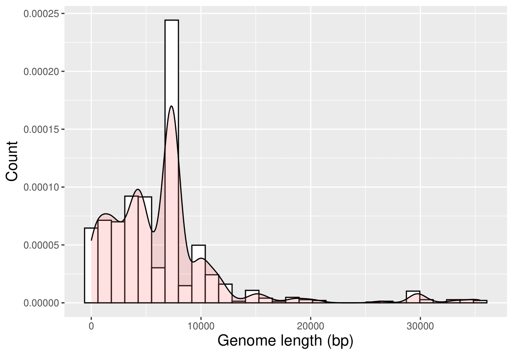

<p align="center">
  
</p>

<h1 align="center">PDB capsid volume analysis</h1>

## Table of Contents
- [Features](#featrues)
- [Usage](#usage)
- [Method](#method)
- [Installation](#installation)
- [Testing](#testing)
- [Analysis](#examples)
- [References](#references)

---

## Features
The script *virus-particle-structure* allows the user to calculate the volume of a viral capsid by parsing a CIF file. The output is:
- PDB entry id;
- Volume in angstroms;

It is also possible to download all of the CIF files that contain information about viral capsids in PDB. This can be achieved by running the *get-virus-data* script that is found in *REST* directory. This script performs the following tasks:
- Deletes all the previous CIF files and generated data;
- Retrieves PDB entry ids for viral capsids by using the JSON parameter file and PDB Search API;
- Checks the CIF file integrity using CIF COD Tools [1-3];
- For each PDB virus capsid entry, extracts the genome length from the NCBI database using Entrez Direct [4];

The following picture depicts what can be done with these programs.


---

## Usage
Usage itself is simple. Here are some examples:
- To calculate viral capsid volume for a given CIF file:
```bash
    ./virus-particle-structure input.cif
    ./virus-particle-structure input.cif > output.tab
```
- To download all possible viral capsid available in PDB archive (all files are stored in *PDB_archive* directory):
```bash
    ./REST/get-virus-data
```
- To perform volume calculation for all of the downloaded files in *PDB_archive* directory:
```
    ./batch_processing > output.tab
```
- Or simply, to reproduce the data, that was used in this analysis you can run the following make command:
```bash
    make reproduce-data
```

---

## Method
Each CIF file contains atom coordinates only for a part of a viral capsid, a certain subunit. The rest of the atom coordinates that make up the viral capsid must be reproduced using the symmetry operators.
The procedure looks like this:


New 3D coordinates are obtained by multiplying the previous ones by a rotation matrix and then applying a translation vector.

## Installation
There is no installation needed. Just download the package and the all of the scripts are ready to use.

---

## Testing
For testing you can run the following make commands:
- To delete all existing test outputs:
```bash
    make clean-tests
```
- To run tests after deleting the test outputs:
```bash
    make test
```

---

## Analysis
After statistical analysis using R, the following results where obtained:


After removing all outliers, the most requent volume of the viral capsids was around 27000000.



After removing all outliers, the most requent genome length for a virus species was around 7500 base pairs.


Next, relationship between these two variables was assesed. By performing shapiro-wilk normal distribution test it was determined, that both datasets were non-normally distributed. Although this was the case, correlation analysis was still performed. The r^2 values was equal to 0.02, which means no linear correlation between these two datasets.

## References

1. Vaitkus, A., Merkys, A. & Gražulis, S. (2021). Validation of the Crystallography Open Database using
the Crystallographic Information Framework. Journal of Applied Crystallography, 54(2), 661-672. doi:
10.1107/S1600576720016532
2. Merkys, A., Vaitkus, A., Butkus, J., Okulič-Kazarinas, M., Kairys, V. & Gražulis, S. (2016).
COD::CIF::Parser: an error-correcting CIF parser for the Perl language. Journal of Applied
Crystallography, 49(1), 292–301. doi: 10.1107/s1600576715022396
3. Gražulis, S., Merkys, A., Vaitkus, A. & Okulič-Kazarinas, M. (2015). Computing stoichiometric molec-
ular composition from crystal structures. Journal of Applied Crystallography, 48(1), 85-91. doi:
10.1107/s1600576714025904